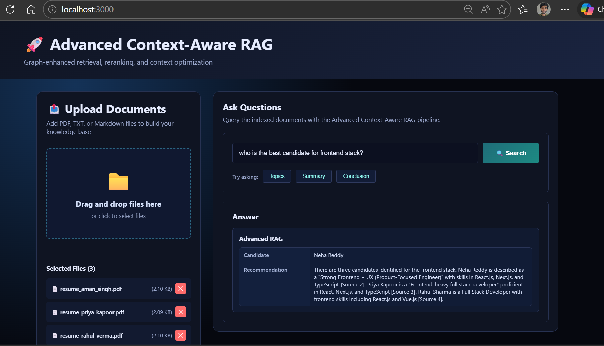

# Advanced Context-Aware RAG

AI-powered Resume Screening & Candidate Matching System using RAG, FastAPI, FAISS, and Gemini Flash.

Advanced Context-Aware RAG is a single-mode retrieval-augmented generation system focused on strong context selection rather than side-by-side mode comparison. The current product combines hybrid retrieval, reranking, semantic graph expansion, context optimization, and Gemini-backed answer generation inside a clean two-column UI for resume screening and candidate matching workflows.

## What The Current App Does

- Upload PDF, TXT, and Markdown documents
- Parse and split documents into chunks
- Build dense and sparse retrieval indexes
- Expand relevant chunks through a semantic graph
- Compress and deduplicate context before answer generation
- Send the selected context to Gemini and render one final answer-first view

Current pipeline:

`Upload -> Chunk -> Embed -> Hybrid Retrieve -> Rerank -> Graph Traverse -> Optimize Context -> Gemini Answer`

## Current Product Layout

- Left panel: document upload and indexing status
- Right panel: question input and final answer
- Dark theme, single-page workspace
- No standard/comparison UI in the primary product flow

## Frontend UI




## Project Structure

```text
RAG-Advanced/
├── backend/
│   ├── app.py
│   ├── requirements.txt
│   ├── data/
│   └── modules/
│       ├── ingest.py
│       ├── embeddings.py
│       ├── hybrid_search.py
│       ├── reranker.py
│       ├── semantic_graph.py
│       ├── context_optimizer.py
│       ├── prompt_builder.py
│       ├── metrics.py
│       └── retriever.py
├── frontend/
│   ├── public/
│   └── src/
│       ├── App.js
│       ├── App.css
│       └── components/
│           ├── DocumentUpload.js
│           ├── QueryInterface.js
│           ├── ChatWindow.js
│           └── ResultsDisplay.js
├── README.md
├── ARCHITECTURE.md
└── SETUP.md
```

## Setup

### Backend

```bash
cd backend
python -m venv venv
venv\Scripts\activate
pip install -r requirements.txt
python app.py
```

Create `backend/.env` and set at least:

```env
API_HOST=0.0.0.0
API_PORT=8000
EMBEDDING_MODEL=sentence-transformers/all-MiniLM-L6-v2
EMBEDDING_FORCE_LOCAL=false
GEMINI_API_KEY=your_key_here
GEMINI_MODEL=gemini-2.5-flash
```

### Frontend

```bash
cd frontend
npm install
npm start
```

Create `frontend/.env` if needed:

```env
REACT_APP_API_URL=http://localhost:8000/api
```

## API Surface In Current Use

- `POST /api/upload` - upload and index documents
- `GET /api/documents` - get indexed document stats
- `GET /api/health` - backend readiness
- `GET /api/retrieve` - primary advanced retrieval + answer endpoint

The backend still contains some legacy compatibility routes, but the active frontend product uses the advanced-only `/api/retrieve` path.

## How Retrieval Works Now

### 1. Ingestion

- Files are parsed with PyPDF2 or text readers
- Text is chunked with overlap
- Each chunk receives document metadata

### 2. Embeddings

- Dense embeddings are generated with sentence-transformers when available
- Local hashing embeddings can be used as a fallback in restricted environments
- FAISS stores dense vectors for similarity search

### 3. Hybrid Retrieval

- Dense semantic search from embeddings
- Sparse BM25 lexical search
- Weighted fusion of both result sets

### 4. Reranking

- Retrieved candidates are rescored for query relevance
- Higher quality chunks are promoted before context construction

### 5. Semantic Graph Expansion

- Related chunks are linked through semantic and structural edges
- Neighbor exploration adds supporting evidence around the top chunks

### 6. Context Optimization

- Deduplication removes overlap
- Relevance filtering keeps only useful content
- Compression reduces token waste before sending context to Gemini

### 7. Answer Generation

- The final selected chunk set is formatted into a prompt
- Gemini receives the question plus the prepared context
- The UI shows the answer and minimal metadata only

## Notes

- The primary user experience is intentionally answer-first
- Detailed metrics and comparison surfaces are no longer part of the main UI
- If Gemini fails, the backend can fall back to local synthesis, but the preferred path is real context-to-LLM generation

For deeper implementation detail, see `ARCHITECTURE.md`.
- L2 distance converted to cosine similarity
- Configurable k for top-k retrieval

### BM25 Search
- Fast lexical/keyword matching
- Works on tokenized corpus
- Complementary to dense search

### Graph Construction
- Lazy loading of embeddings
- Cached similarity scores
- Efficient networkx operations

### Context Optimization
- Parallel document processing
- Configurable compression levels
- Early termination on token limits

## 🔐 Security Considerations

- API runs locally by default
- No external LLM calls in current implementation
- Document data stored locally
- CORS configured for frontend communication

## 🛠️ Troubleshooting

### Backend Issues
```bash
# ModuleNotFoundError
pip install -r requirements.txt --upgrade

# FAISS not available
pip install faiss-cpu  # or faiss-gpu

# Port already in use
uvicorn app:app --port 8001
```

### Frontend Issues
```bash
# Dependencies not installed
rm -rf node_modules package-lock.json
npm install

# API connection failed
# Check REACT_APP_API_URL in .env
# Ensure backend is running on configured port
```

## 📚 References

- [Sentence-transformers Documentation](https://www.sbert.net/)
- [FAISS Documentation](https://github.com/facebookresearch/faiss)
- [BM25 Algorithm](https://en.wikipedia.org/wiki/Okapi_BM25)
- [RAG Techniques](https://arxiv.org/abs/2005.11401)

## 🤝 Contributing

Contributions welcome! Areas for enhancement:
- Additional embedding models
- Different reranking strategies
- Enhanced graph algorithms
- Streaming responses
- Docker containerization
- Production API deployment

## 📄 License

MIT License - feel free to use for research and commercial projects.

## 🎓 Use Cases

1. **Document Q&A**: Ask questions about uploaded documents
2. **Knowledge Base**: Build searchable knowledge bases
3. **Research**: Compare RAG architectures
4. **Education**: Learn about RAG systems
5. **Production**: Deploy as document search service

## 📞 Support

For issues or questions:
1. Check troubleshooting section
2. Review API documentation
3. Check component props and configurations
4. Ensure all dependencies installed

---

**Built with ❤️ for advanced RAG research and production use**
